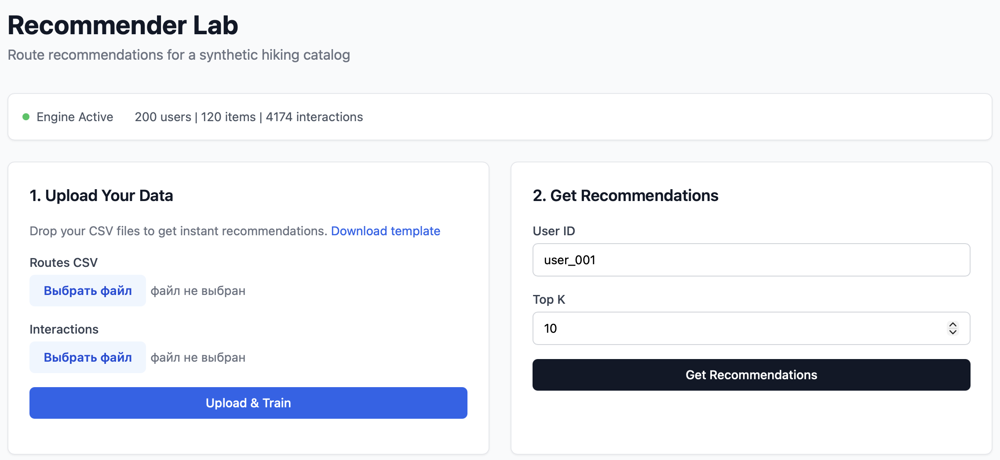
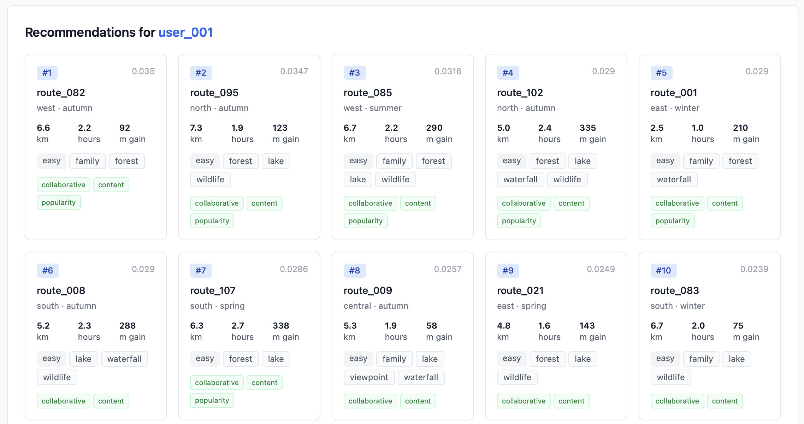
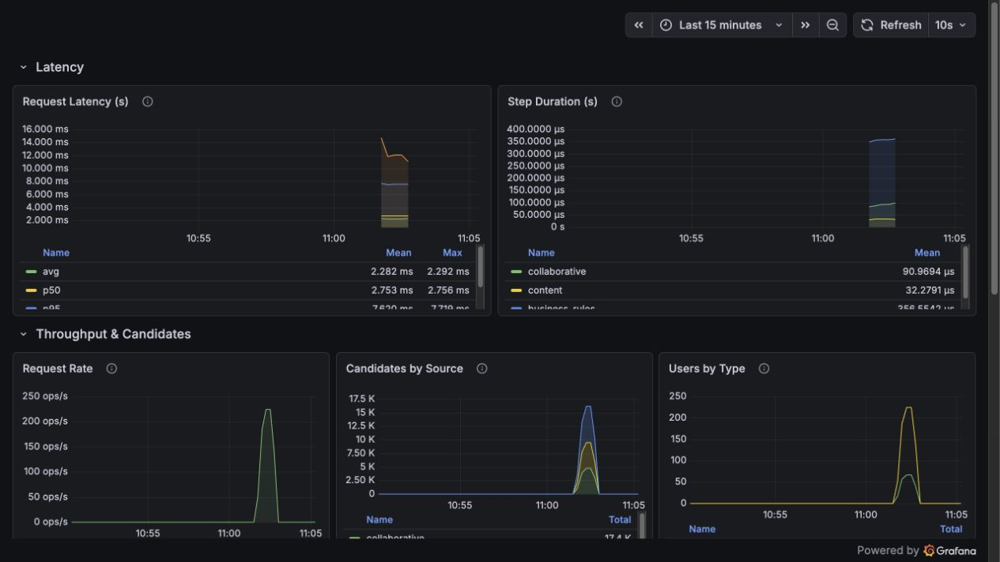
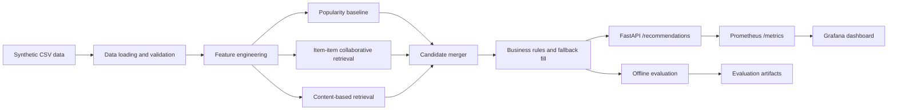

# Hiking Route Recommender Demo

Synthetic commercial-style demo of a recommendation system for a hiking and tourism route catalog.

[](https://github.com/ikonushok/hiking-route-recommender-demo/actions/workflows/ci.yml)

The project demonstrates a practical catalog recommendation pipeline:

```text
synthetic data -> data loading -> feature engineering -> baseline -> retrieval -> merge -> business rules -> evaluation -> API
```

## Portfolio Fit

Best for: ML / recommender engineering portfolio.

Shows: synthetic data pipeline, hybrid retrieval, business rules, offline evaluation, FastAPI serving, Docker, CI and observability.

## 30-Second Demo

Start the full demo stack:

```bash
docker compose up --build
```

Available after startup:

- Web UI: `http://localhost:8000`
- API docs: `http://localhost:8000/docs`
- API health: `http://localhost:8000/health`
- API metrics: `http://localhost:8000/metrics`
- Prometheus: `http://localhost:9090`
- Grafana: `http://localhost:3000`

Example API request:

```bash
curl -sS -X POST http://localhost:8000/recommendations \
  -H 'Content-Type: application/json' \
  -d '{"user_id":"user_001","region":"north","top_k":5,"max_difficulty":"moderate"}'
```

Stop the stack:

```bash
docker compose down
```

## What This Proves

This is not just a model wrapped in an API. The project shows an end-to-end service shape:

- reproducible synthetic data pipeline without client data;
- hybrid recommender: popularity, collaborative retrieval, content-based retrieval and candidate merger;
- post-retrieval business rules with hard filters and fallback path;
- offline evaluation artifacts for quality, coverage, novelty and diversity;
- FastAPI serving contract with `/health`, `/recommendations`, `/metrics` and OpenAPI docs;
- interactive web UI for a quick portfolio walkthrough;
- Docker Compose stack with API, Prometheus, Pushgateway and Grafana;
- GitHub Actions CI for install, tests, smoke scripts, offline evaluation and Docker image build.

## Demo Screenshots







Grafana metrics in the screenshot are generated from synthetic load-test traffic.

## Security Boundary

The repository uses fully synthetic data.

It does not contain:

- client data;
- production code;
- proprietary database schema;
- internal business metrics;
- customer-specific business logic.

## Demo Scope

The MVP is intentionally compact, but it covers the full practical loop of a recommendation system:

- reproducible synthetic data generation;
- validated CSV loading;
- feature engineering for routes;
- user-route implicit-feedback matrix;
- popularity baseline with region filter, seen-route exclusion and cold-start fallback behavior;
- item-item collaborative retriever;
- content-based retriever;
- rank-based candidate merger;
- post-retrieval business rules for region, difficulty, seen-route exclusion and fallback fill;
- offline top-K evaluation on held-out synthetic interactions, including precision, recall, MAP, NDCG, coverage, novelty and diversity;
- FastAPI endpoint for online-style recommendation serving;
- web UI for manual walkthrough;
- Prometheus metrics and Grafana dashboard;
- Docker and CI packaging for reproducible execution.

## Data Dictionary

The public demo schema is intentionally small and synthetic.

### `data/synthetic_routes.csv`

| Field | Meaning | Example |
|---|---|---|
| `route_id` | Public synthetic route identifier | `route_095` |
| `region` | Synthetic route region label | `north`, `east`, `central` |
| `length_km` | Route length in kilometers | `7.3` |
| `duration_hours` | Estimated route duration | `1.9` |
| `elevation_gain_m` | Elevation gain in meters | `123` |
| `difficulty` | Route difficulty bucket | `easy`, `moderate`, `hard` |
| `popularity` | Synthetic popularity score in `[0, 1]` | `0.87` |
| `season` | Best synthetic season label | `spring`, `summer`, `autumn`, `winter` |
| `route_tags` | Pipe-separated synthetic route tags | `forest|lake|wildlife` |

### `data/synthetic_users.csv`

| Field | Meaning | Example |
|---|---|---|
| `user_id` | Public synthetic user identifier | `user_001` |
| `preferred_difficulty` | Synthetic user preference | `easy` |
| `preferred_region` | Synthetic region preference | `north` |
| `preferred_season` | Synthetic season preference | `autumn` |
| `preferred_tags` | Pipe-separated synthetic tag preference | `forest|lake` |
| `activity_level` | Synthetic user activity bucket | `regular` |

### `data/synthetic_interactions.csv`

| Field | Meaning | Example |
|---|---|---|
| `user_id` | Synthetic user identifier | `user_001` |
| `route_id` | Synthetic route identifier | `route_095` |
| `interaction_type` | Generic implicit-feedback event | `view`, `like`, `visit`, `checkin` |
| `timestamp` | Synthetic event timestamp | ISO timestamp |
| `interaction_weight` | Event weight used by retrieval features | `1`, `3`, `5`, `8` |

`east`, `north`, `south`, `west` and `central` are generic synthetic region labels. They are not real locations.

## Architecture Diagram



## Pipeline Overview

In a production-like system the input could come from SQLite, warehouse tables or service events. In this demo the input is fixed as reproducible synthetic CSV files.

```text
data/synthetic_users.csv
data/synthetic_routes.csv
data/synthetic_interactions.csv
    |
    v
data_loader.py
    |
    v
validated synthetic users/routes/interactions datasets
    |
    v
features.py
    |
    v
route features + user-route implicit-feedback matrix + seen-route maps
    |
    v
baseline.py / collaborative.py / content_based.py
    |
    v
retrieval candidates from popularity, item-item collaborative and content-based sources
    |
    v
merger.py
    |
    v
deduplicated hybrid candidate list with merged scores and sources
    |
    v
business_rules.py
    |-- region filter
    |-- difficulty filter
    |-- seen-route exclusion
    `-- fallback fill
    |
    v
evaluation.py / api.py
    |
    v
offline metrics / hybrid API response
    |
    v
final recommendations
```

## Project Layout

```text
project/
├─ README.md
├─ pyproject.toml
├─ requirements.txt
├─ Dockerfile
├─ docker-compose.yml
├─ prometheus.yml
├─ LICENSE
├─ .github/workflows/ci.yml
│
├─ data/
│  ├─ synthetic_users.csv
│  ├─ synthetic_routes.csv
│  ├─ synthetic_interactions.csv
│  ├─ synthetic_interactions_train.csv
│  └─ synthetic_interactions_test.csv
│
├─ scripts/
│  ├─ generate_synthetic_data.py
│  ├─ run_baseline_smoke.py
│  ├─ run_hybrid_smoke.py
│  └─ run_offline_evaluation.py
│
├─ src/hiking_recommender/
│  ├─ data_loader.py
│  ├─ schemas.py
│  ├─ features.py
│  ├─ baseline.py
│  ├─ collaborative.py
│  ├─ content_based.py
│  ├─ candidates.py
│  ├─ merger.py
│  ├─ business_rules.py
│  ├─ evaluation.py
│  ├─ monitoring.py
│  ├─ pipeline_metrics.py
│  ├─ web_ui.py
│  ├─ templates/
│  └─ api.py
│
├─ tests/
│  ├─ test_api.py
│  ├─ test_baseline_smoke.py
│  ├─ test_business_rules.py
│  ├─ test_data_loader.py
│  ├─ test_evaluation.py
│  ├─ test_features.py
│  ├─ test_hybrid_retrieval.py
│  └─ load_test.py
│
├─ docs/
│  ├─ assets/
│  ├─ p0_baseline.md
│  ├─ architecture.md
│  ├─ data_readiness_checklist.md
│  ├─ commercial_use_cases.md
│  └─ evaluation_report.md
│
├─ outputs/
│  └─ evaluation_metrics.csv
│
├─ grafana/
│  ├─ dashboards/
│  └─ datasources/
│
└─ notebooks/
   └─ 01_pipeline_demo.ipynb
```

## Baseline Status

P0 is treated as the stable baseline for this demo. It includes synthetic data generation, feature engineering, popularity/collaborative/content retrieval, candidate merging, business rules, offline evaluation and FastAPI serving.

Future ranking logic should be treated as a post-P0 extension, not as a hidden replacement for the stable baseline.

Frozen P0 scope, contracts, validation commands and extension boundaries are documented in `docs/p0_baseline.md`.

## Local Development

Install the package locally:

```bash
python -m pip install -e ".[dev]"
```

Create or refresh the synthetic dataset:

```bash
python scripts/generate_synthetic_data.py
```

Run baseline smoke check:

```bash
python scripts/run_baseline_smoke.py
```

Run hybrid retrieval smoke check:

```bash
python scripts/run_hybrid_smoke.py
```

Run offline evaluation:

```bash
python scripts/run_offline_evaluation.py
```

Run tests:

```bash
python -m pytest
```

## Docker Demo

Start the API and observability stack with one command:

```bash
docker compose up --build
```

Check API health:

```bash
curl -sS http://localhost:8000/health
```

Check recommendations:

```bash
curl -sS -X POST http://localhost:8000/recommendations \
  -H 'Content-Type: application/json' \
  -d '{"user_id":"user_001","region":"north","top_k":5,"max_difficulty":"moderate"}'
```

Check Prometheus targets:

```bash
curl -sS http://localhost:9090/api/v1/targets
```

Stop the stack:

```bash
docker compose down
```

## Observability

API exposes Prometheus metrics at `/metrics`. The Docker Compose stack scrapes:

- `api:8000` for API/runtime metrics;
- `pushgateway:9091` for offline/load-test metrics pushed from scripts.

Grafana is provisioned from `grafana/dashboards/recommender-demo.json` and uses the Prometheus datasource from `grafana/datasources/prometheus.yml`.

Useful URLs after `docker compose up --build`:

- `http://localhost:8000/metrics`
- `http://localhost:9090`
- `http://localhost:3000`

## CI

GitHub Actions workflow: `.github/workflows/ci.yml`.

It validates:

- editable install with `.[dev]`;
- full pytest suite;
- baseline and hybrid smoke scripts;
- offline evaluation artifacts;
- Docker Compose config;
- API image build.

## Evaluation Artifacts

Offline evaluation writes synthetic metrics to:

- `outputs/evaluation_metrics.csv`;
- `docs/evaluation_report.md`.

The metrics are useful for checking the demo pipeline: ranking quality (`precision`, `recall`, `MAP`, `NDCG`), catalog reach (`coverage`) and P1 signals for popularity bias and list variety (`novelty`, `diversity`). They are not claims about production quality or business impact.

## Notebook Demo

Open the end-to-end notebook:

```bash
jupyter notebook notebooks/01_pipeline_demo.ipynb
```

The notebook shows data loading, feature engineering, retrieval sources, candidate merging, business rules, offline metrics including novelty/diversity and an API payload example.

## Web UI Demo

After starting the API, open:

```text
http://localhost:8000
```

The web UI shows:

- loaded synthetic dataset health;
- upload form for custom CSV files that match the public synthetic schema;
- recommendation search by `user_id` and `top_k`;
- ranked recommendation cards with route metadata and retrieval sources.

## API Demo

Start the API locally:

```bash
uvicorn hiking_recommender.api:app --reload
```

Example API request:

```bash
curl -sS -X POST http://127.0.0.1:8000/recommendations \
  -H 'Content-Type: application/json' \
  -d '{"user_id":"user_001","region":"north","top_k":5,"max_difficulty":"moderate"}'
```

Example response:

```json
{
  "user_id": "user_001",
  "recommendations": [
    {
      "route_id": "route_095",
      "rank": 1,
      "score": 0.0377,
      "difficulty": "easy",
      "sources": ["collaborative", "content", "popularity"]
    }
  ]
}
```

## Baseline Output Example

```text
Popularity baseline smoke passed
rank=1 route_id=route_095 score=0.8730 source=popularity
rank=2 route_id=route_054 score=0.6554 source=popularity
```

Exact `route_id` values and scores can change when the synthetic generator configuration changes.

## Load Test

With the API running, execute a small HTTP load test:

```bash
LOAD_TEST_TARGET=http://localhost:8000 python tests/load_test.py --duration 30 --concurrency 10
```

The script prints a latency/RPS summary and saves a local report to `outputs/load_test_report.json`.

If Pushgateway is available, load-test metrics are pushed there and become visible in Prometheus/Grafana.

## Module Boundaries

The MVP keeps responsibilities separated:

- `data_loader.py` validates public synthetic CSV contracts.
- `features.py` builds reusable route and interaction features.
- `baseline.py` provides the simplest reliable recommendation source.
- `collaborative.py` implements item-item retrieval over implicit feedback.
- `content_based.py` builds route-profile retrieval from item features.
- `merger.py` deduplicates and ranks candidates from multiple sources.
- `business_rules.py` applies hard route filters after retrieval and before serving.
- `evaluation.py` computes offline top-K metrics on synthetic test interactions.
- `api.py` serves the MVP pipeline through `GET /health` and `POST /recommendations`.

Detailed module boundaries are documented in `docs/architecture.md`.

Client-facing checklist and demo portability are documented in `docs/data_readiness_checklist.md` and `docs/commercial_use_cases.md`.

ALS is intentionally not part of the first MVP. The initial collaborative model uses item-item cosine similarity over an implicit-feedback matrix so the candidate merger can be built without heavy dependencies.
