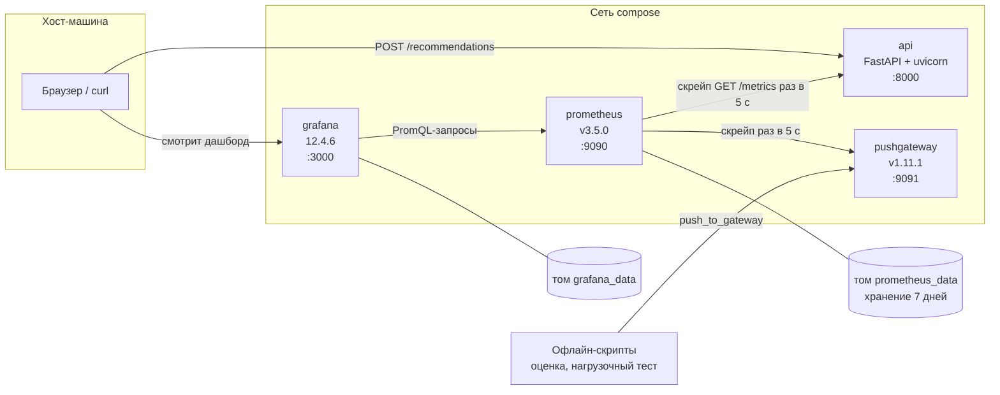
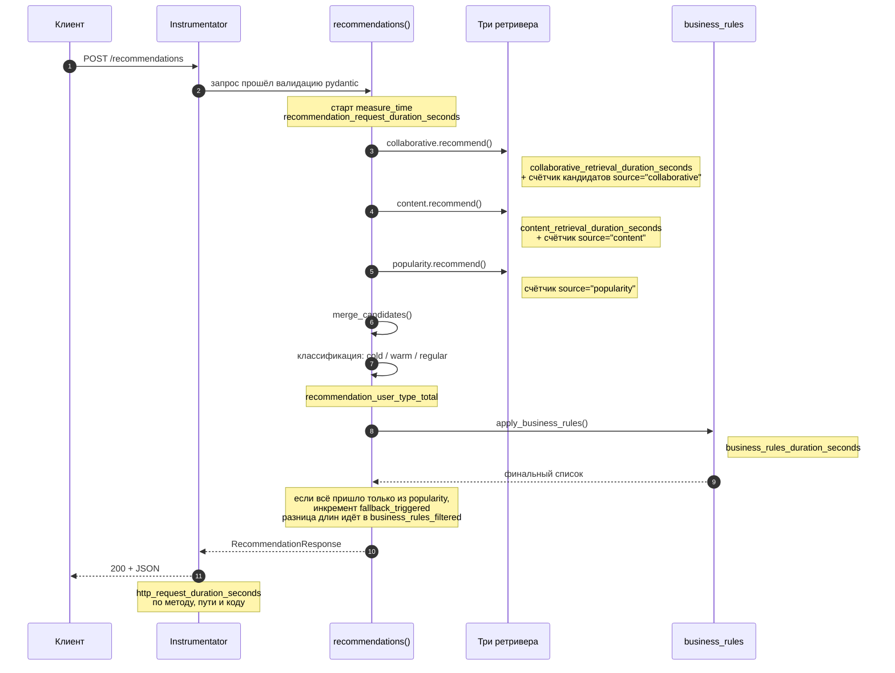
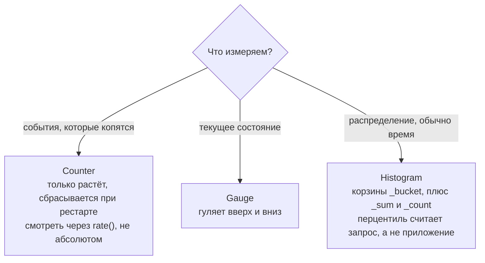
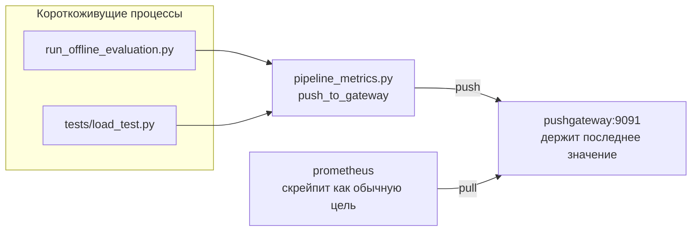
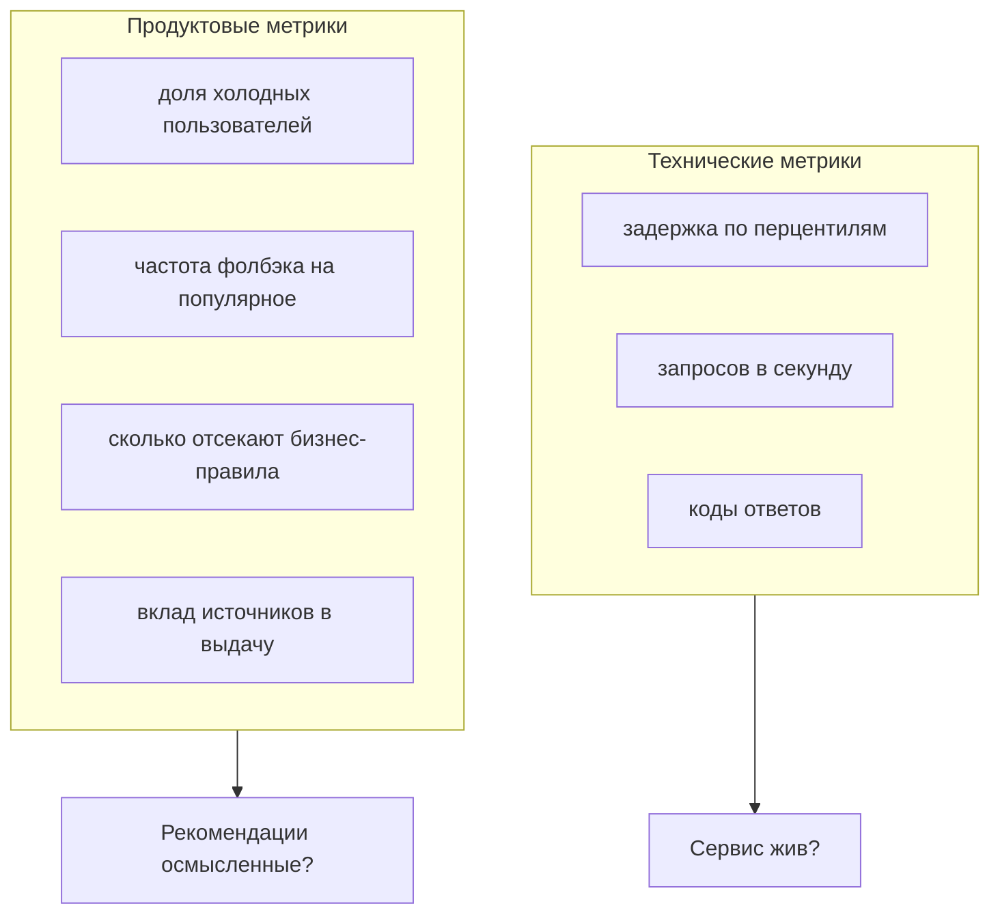
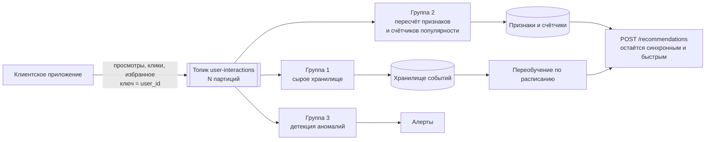

# Сервис, контейнеры и мониторинг

`docs/architecture.md` описывает пайплайн рекомендаций: как из синтетических данных получаются кандидаты и как их отбирают бизнес-правила. Этот документ про обвязку вокруг: что запускается в контейнерах, как запрос проходит через приложение, откуда берётся каждая метрика и что показывает Grafana.

Схемы нарисованы на Mermaid, GitHub и PyCharm показывают их без плагинов.

---

## 1. Общая картина

`docker compose up` поднимает четыре контейнера в одной сети. Внутри сети они видят друг друга по имени сервиса, снаружи доступны через проброшенные порты.



Три особенности этой схемы стоит отметить сразу.

Стрелка между Prometheus и api направлена от Prometheus. Сервис никуда ничего не отправляет, он только держит эндпоинт `/metrics` и ждёт. Это pull-модель.

Grafana не касается api вообще. Она ходит только в Prometheus и не хранит ни одной точки данных сама.

Pushgateway стоит особняком, потому что решает отдельную задачу: скрипт, который отработал минуту и завершился, скрейпить некому, поэтому он отправляет метрики сам.

---

## 2. Карта модулей

| Файл | За что отвечает |
|---|---|
| `src/hiking_recommender/api.py` | приложение FastAPI, эндпоинты `/health` и `/recommendations`, сборка runtime при старте |
| `src/hiking_recommender/monitoring.py` | метрики сервиса, эндпоинт `/metrics`, контекстный менеджер замера времени |
| `src/hiking_recommender/pipeline_metrics.py` | отправка метрик офлайн-прогонов в Pushgateway |
| `src/hiking_recommender/web_ui.py` | веб-интерфейс на Jinja2: загрузка своего CSV и поиск |
| `src/hiking_recommender/schemas.py` | pydantic-схемы запроса и ответа |
| `docker-compose.yml` | четыре сервиса, тома, healthcheck, порядок старта |
| `Dockerfile` | сборка образа api |
| `prometheus.yml` | что и как часто скрейпить |
| `grafana/datasources/prometheus.yml` | подключение источника данных |
| `grafana/dashboards/recommender-demo.json` | десять панелей дашборда |

Модули рекомендательной логики (`baseline.py`, `collaborative.py`, `content_based.py`, `merger.py`, `business_rules.py`, `evaluation.py`) разобраны в `docs/architecture.md`.

---

## 3. Сборка образа

```dockerfile
FROM python:3.12-slim-bookworm
WORKDIR /app
COPY pyproject.toml README.md ./
COPY src ./src
COPY data ./data
RUN python -m pip install .
EXPOSE 8000
HEALTHCHECK ... CMD python -c "... urlopen('http://127.0.0.1:8000/health') ..."
CMD ["uvicorn", "hiking_recommender.api:app", "--host", "0.0.0.0", "--port", "8000"]
```

**Порядок инструкций и кэш слоёв.** Каждая строчка Dockerfile даёт слой, слои кэшируются. Манифест копируется раньше исходников намеренно: правка кода пересобирает только последние слои, а установка зависимостей берётся из кэша. При обратном порядке любая мелкая правка тянула бы полную переустановку пакетов.

**Базовый образ `slim`** это урезанный Debian: меньше вес, меньше поверхность атаки. Плата за это в том, что иногда не хватает системных библиотек под сборку колёс.

**Адрес прослушивания.** Uvicorn запускается с `--host 0.0.0.0`, потому что у контейнера свой сетевой стек и `127.0.0.1` означал бы «слушать самого себя». В healthcheck при этом стоит именно `127.0.0.1`, и это корректно: проверка выполняется внутри того же контейнера.

**Порты.** Запись `"8000:8000"` в compose пробрасывает порт хоста в порт контейнера, левое число снаружи, правое внутри.

**Тома.** Файловая система контейнера умирает вместе с ним, поэтому `prometheus_data` и `grafana_data` вынесены в именованные тома: перезапуск не стирает историю метрик и настройки дашбордов.

**Порядок старта.** Prometheus зависит от api с условием `service_healthy`, то есть ждёт не факта запуска, а прохождения healthcheck. Параметр `start_period: 10s` даёт фору на загрузку данных, чтобы первые неудачные проверки не считались падением.

Демо намеренно обходится без multi-stage сборки, непривилегированного пользователя и внешнего хранилища секретов. Для продового образа всё это понадобится.

---

## 4. Путь запроса

FastAPI работает поверх стандарта ASGI, поэтому под ним стоит ASGI-сервер uvicorn. Схемы в `schemas.py` дают валидацию входа и автоматический OpenAPI на `/docs`: некорректное тело запроса pydantic отклоняет сам, с кодом 422.

Ниже путь `POST /recommendations` с отметками, в какой точке снимается какая метрика.



Классификация пользователя происходит тут же в обработчике: пустая история значит `cold`, до трёх просмотренных маршрутов значит `warm`, дальше `regular`. Эта разметка нужна не ответу, а метрике: по ней видно, какая доля трафика приходит без истории.

### Три решения, которые стоят за этим кодом

**Модели грузятся один раз.** Строка `runtime = build_runtime()` стоит на уровне модуля, то есть данные читаются и модели обучаются при импорте приложения, а не на каждый запрос. Более аккуратный вариант для прода это lifespan-хук, который грузит артефакты при старте и освобождает при остановке.

**Обработчики синхронные.** Асинхронный обработчик выполняется в общем цикле событий, и тяжёлый синхронный pandas внутри него заблокировал бы параллельные запросы. Обычный `def` FastAPI уводит в пул потоков. Общее правило: `async` выигрывает, когда сервис ждёт сеть или диск, и ничего не даёт, когда он считает.

**Несколько воркеров ломают метрики.** Uvicorn в четыре процесса это четыре копии модели в памяти и четыре независимых набора счётчиков. Prometheus придёт на `/metrics`, попадёт в случайный процесс и увидит его кусок правды. Ветка с `PROMETHEUS_MULTIPROC_DIR` в `monitoring.py` решает ровно это: `prometheus_client` складывает счётчики в общий каталог на диске, а `MultiProcessCollector` собирает их вместе.

---

## 5. Метрики

Всё, что заведено в `monitoring.py`, плюс то, что добавляет `Instrumentator`.

| Метрика | Тип | Лейблы | Где растёт |
|---|---|---|---|
| `recommendation_request_duration_seconds` | Histogram | нет | весь обработчик целиком |
| `collaborative_retrieval_duration_seconds` | Histogram | нет | шаг коллаборативного поиска |
| `content_retrieval_duration_seconds` | Histogram | нет | шаг контентного поиска |
| `business_rules_duration_seconds` | Histogram | нет | шаг бизнес-правил |
| `recommendation_candidates_total` | Counter | `source` | после каждого из трёх ретриверов |
| `recommendation_user_type_total` | Counter | `type` | после классификации пользователя |
| `recommendation_fallback_triggered_total` | Counter | нет | когда весь ответ собран только из популярного |
| `business_rules_filtered_total` | Counter | нет | на разницу длин до и после фильтров |
| `model_users_count` | Gauge | нет | один раз при старте |
| `model_items_count` | Gauge | нет | один раз при старте |
| `model_interactions_count` | Gauge | нет | один раз при старте |
| `http_request_duration_seconds` и семейство | Histogram | метод, путь, код | автоматически через `Instrumentator` |

Как выбирается тип:



Для времени ответа подходит только гистограмма, потому что среднее прячет хвост. Сто быстрых запросов и один десятисекундный дают приличное среднее и никуда не годный опыт для того одного пользователя. Перцентиль показывает, как живут худшие.

**Кардинальность.** Каждая комбинация лейблов это отдельная временная последовательность в базе. Лейбл `source` с тремя значениями стоит дёшево, а `user_id` в лейбле развалил бы Prometheus: миллион пользователей означал бы миллион последовательностей. Отсюда правило: лейблы только с конечным и небольшим набором значений.

Три gauge объявлены с `multiprocess_mode="max"`, чтобы в многопроцессном режиме брать максимум по процессам, а не сумму копий одного и того же числа.

---

## 6. Prometheus

Конфигурация в `prometheus.yml`, две цели, интервал пять секунд:

```yaml
scrape_configs:
  - job_name: "recommender-demo"
    static_configs:
      - targets: ["api:8000"]
  - job_name: "pushgateway"
    honor_labels: true
    static_configs:
      - targets: ["pushgateway:9091"]
```

**Почему цель записана как `api:8000`.** Compose поднимает общую сеть и резолвит имена сервисов как DNS-имена, поэтому слово `api` превращается в адрес соседнего контейнера. Адрес `localhost` в этом файле указывал бы на сам Prometheus, и скрейп ушёл бы в никуда.

**Интервал пять секунд** выбран под демо, где хочется видеть реакцию графиков почти сразу. В проде обычно ставят от пятнадцати до шестидесяти, потому что каждый скрейп это и нагрузка на сервис, и точки в базе.

**Хранение** ограничено семью днями через `--storage.tsdb.retention.time=7d`. Prometheus не архив, а оперативная память наблюдения. Долгую историю выносят в Thanos, Mimir или VictoriaMetrics.

**Флаг `honor_labels: true`** у второй цели запрещает перетирать лейблы, пришедшие из задачи, служебными `job` и `instance`. Без него метрики офлайн-прогона потеряли бы свою принадлежность.

Запросы, на которых построен дашборд:

```promql
# средняя длительность запроса за минуту
rate(recommendation_request_duration_seconds_sum[1m])
  / rate(recommendation_request_duration_seconds_count[1m])

# 95-й перцентиль из корзин гистограммы
histogram_quantile(0.95, rate(recommendation_request_duration_seconds_bucket[1m]))

# поток запросов в секунду
rate(recommendation_request_duration_seconds_count[1m])

# кандидаты в разбивке по источникам
rate(recommendation_candidates_total[1m])
```

Функция `rate()` берёт скорость роста счётчика за окно и корректно обрабатывает сброс при рестарте. Абсолютное значение счётчика само по себе не несёт смысла.

---

## 7. Pushgateway

Задача, которую решает этот контейнер, узкая. Скрипт офлайн-оценки отрабатывает минуту и завершается. Prometheus приходит раз в пять секунд, но приходить уже некуда: процесса нет. Такая задача отправляет результат сама, а Prometheus забирает его из промежуточного хранилища.



В `pipeline_metrics.py` две функции, поштучная отправка и пакетная. Обе работают через отдельный `CollectorRegistry`, чтобы не смешиваться с метриками сервиса. Адрес и таймаут читаются из переменных окружения `PUSHGATEWAY_URL` и `PUSHGATEWAY_TIMEOUT_SECONDS`, а `PROMETHEUS_PUSH_ENABLED=0` полностью отключает отправку. Ошибка отправки не роняет прогон: она печатается и проглатывается, потому что телеметрия не должна ломать основную работу.

Ограничение, о котором стоит помнить: Pushgateway держит последнее отправленное значение до тех пор, пока его не удалят. Для обычных сервисов он не подходит, только для задач, которые живут меньше интервала скрейпа.

---

## 8. Grafana

Grafana ничего не хранит. Каждая панель это запрос в Prometheus, выполняемый в момент отрисовки.

Настройка идёт через provisioning, то есть файлами, а не руками в веб-интерфейсе. В compose примонтированы два каталога в `/etc/grafana/provisioning`:

- `grafana/datasources/prometheus.yml` объявляет источник с адресом `http://prometheus:9090` и делает его основным;
- `grafana/dashboards/default.yml` включает подхват дашбордов из каталога, а сам дашборд лежит в `recommender-demo.json`.

| Панель | Что показывает |
|---|---|
| Request Latency | среднее плюс перцентили 50, 95 и 99 |
| Step Duration | средняя длительность трёх шагов по отдельности |
| Request Rate | запросов в секунду |
| Candidates by Source | сколько кандидатов дал каждый из трёх источников |
| Users by Type | поток холодных, тёплых и постоянных пользователей |
| Fallback Rate | как часто ответ собран только из популярного |
| Candidates Filtered by Business Rules | сколько кандидатов отсекают фильтры |
| Users in Model / Items in Model / Training Interactions | три числа-индикатора размера модели |

Панель Step Duration отвечает на вопрос «где именно тормозит», а не «тормозит ли вообще». Разложение общего времени по шагам стоит недорого и заметно ускоряет диагностику.

---

## 9. Что мерить у рекомендательного сервиса

Обычный веб-сервис описывают три величины: задержка, поток, доля ошибок. Рекомендательному этого мало, потому что он может отвечать быстро и без единой ошибки, выдавая при этом бессмысленный список.



Правую половину в этом проекте закрывают счётчики `recommendation_fallback_triggered_total`, `business_rules_filtered_total`, `recommendation_user_type_total` и `recommendation_candidates_total`. Смысл в раннем сигнале: рост доли фолбэка виден задолго до жалоб и означает, что персонализация перестала находить кандидатов.

Дрейфа данных, онлайн-качества и A/B-сравнения тут нет и быть не может: демо работает на синтетике, живого потока событий в нём не существует.

---

## 10. Как это разворачивается на поток событий

Раздел описывает направление развития, в текущем коде его нет. Сейчас `/recommendations` синхронный: пришёл запрос, посчитали три источника, слили, применили правила, ответили. Если вместо разовых запросов появится поток пользовательских событий, архитектура раскладывается так.



Ключевой принцип такой схемы: тяжёлая работа уходит из запроса. Эндпоинт читает уже посчитанные признаки и счётчики, а обновляет их отдельный поток потребителей, поэтому задержка ответа не зависит от объёма входящих событий.

**Топик и партиции.** Топик это именованный поток, партиция это его кусок. Порядок сообщений гарантирован внутри партиции, а не внутри топика целиком.

**Ключ сообщения** определяет партицию через хеш. С ключом `user_id` все события одного пользователя попадают в одну партицию и приходят по порядку.

**Consumer group.** Внутри одной группы одну партицию читает ровно один потребитель, отсюда потолок параллелизма: потребителей больше, чем партиций, ничего не ускорят. Три группы на схеме читают один и тот же поток независимо, каждая со своей закладкой. Этим Kafka отличается от обычной очереди: она не удаляет сообщение после чтения, а хранит его заданное время, и читатель может перемотать назад.

**Offset и лаг.** Offset это порядковый номер записи, закладка группы. Лаг это разница между последней записью и последней прочитанной, основная метрика здоровья потребителя.

**Семантика доставки.** Практический режим по умолчанию это at least once, то есть повтор рано или поздно случится, и обработчик должен быть идемпотентным по ключу операции. Сообщения, которые не удалось обработать за несколько попыток, уводят в отдельный топик, dead letter queue, чтобы они не забивали основной поток и не терялись молча.

**Kafka против очереди задач.** Celery поверх Redis или RabbitMQ решает другую задачу: отдать фоновую работу воркеру, дождаться результата, повторить при ошибке. Отправка письма или ночной пересчёт отчёта ложатся на Celery. Поток событий, который одновременно нужен аналитике, счётчикам и переобучению, ложится на Kafka.

---

## 11. Ограничения демо

Проект собран как витрина пайплайна, а не как продовый сервис. Что сюда сознательно не вошло:

- данные лежат в CSV и грузятся в память при старте, базы нет;
- один процесс uvicorn, без горизонтального масштабирования; многопроцессный режим метрик подготовлен, но не задействован;
- нет аутентификации, ограничения частоты запросов и CORS-политики;
- Grafana поднята с анонимным входом под ролью Admin и паролем по умолчанию, что допустимо только на локальной машине;
- compose на одной машине, без оркестрации, канареечных выкатов и раздельных окружений;
- офлайн-метрики считаются на синтетике и годятся как проверка пайплайна, но не как заявление о бизнес-эффекте.

---

## 12. Куда смотреть дальше

| Тема | Файлы |
|---|---|
| Сборка образа, кэш слоёв, healthcheck | `Dockerfile` |
| Состав сервисов, сеть, тома, порядок старта | `docker-compose.yml` |
| Скрейп и хранение метрик | `prometheus.yml` |
| Определение метрик и эндпоинт `/metrics` | `src/hiking_recommender/monitoring.py` |
| Точки съёма метрик по ходу запроса | `src/hiking_recommender/api.py` |
| Метрики офлайн-прогонов | `src/hiking_recommender/pipeline_metrics.py` |
| Панели и запросы дашборда | `grafana/dashboards/recommender-demo.json` |
| Подключение источника данных | `grafana/datasources/prometheus.yml` |
| Контракт запроса и ответа | `src/hiking_recommender/schemas.py` |
| Логика рекомендаций и метрики качества | `docs/architecture.md`, `docs/evaluation_report.md` |
